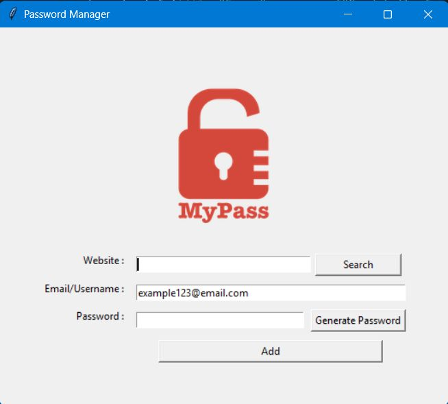
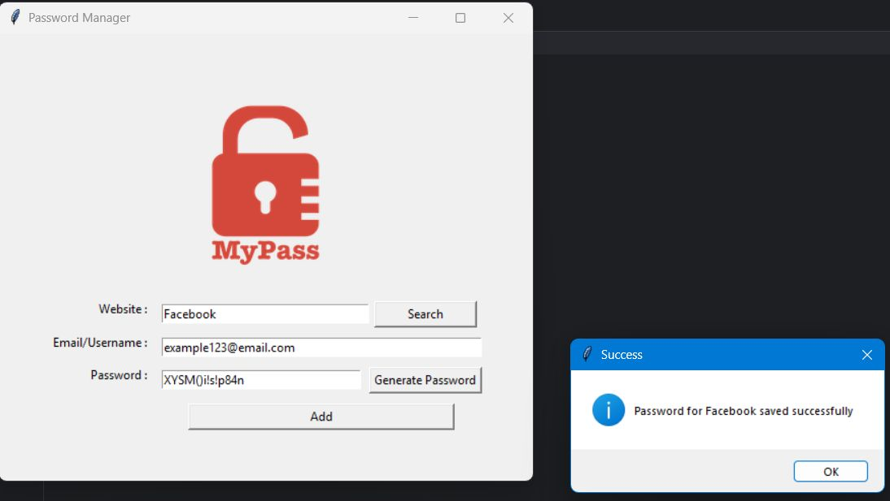
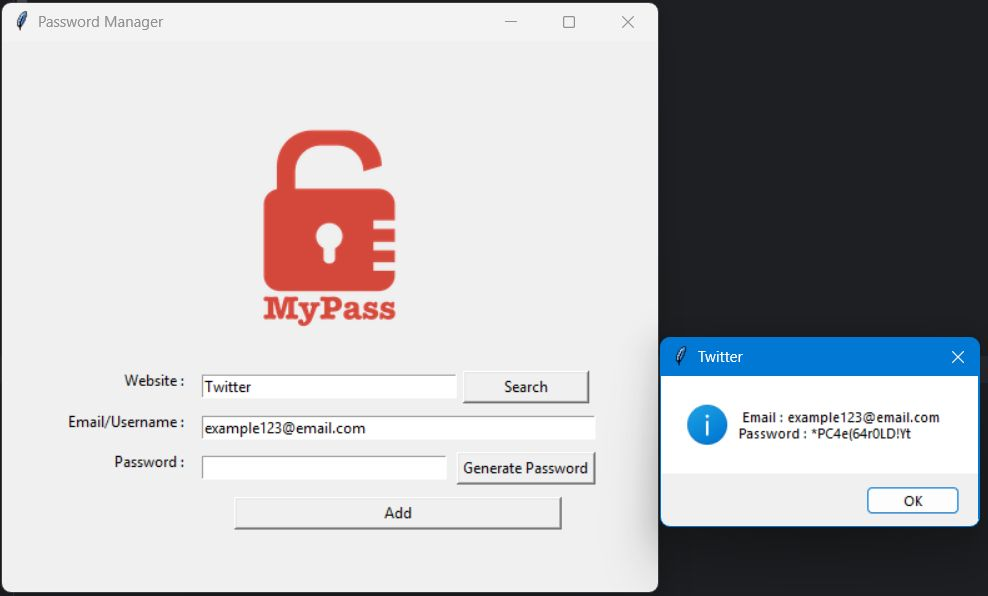

# Password Manager 

A simple **Tkinter-based Password Manager** built with Python.  
Features include password generation, secure storage in JSON, and quick search functionality.

---

## Project Structure
```
password-manager/
├── main.py                # Tkinter app
├── Password_Save_File.json # Example data file
├── logo.png               # Lock icon for GUI
└── README.md              # Documentation
```
---

## ⚙️ Requirements
- Python 3.8+
- [pyperclip](https://pypi.org/project/pyperclip/)

Install dependency:
```bash
pip install pyperclip
```


## Usage

Run the app:
```
python main.py
```

**Features:**

- Generate Passwords → creates strong random passwords and copies them to clipboard.
- Save Credentials → stores website, email, and password in JSON file.
- Search → quickly retrieves saved credentials by website name.


---

### Example JSON Output
```
{
  "Twitter": {
    "email": "arun123@email.com",
    "password": "*PC4e(64r0LD!Yt"
  },
  "Amazon": {
    "email": "arun123@email.com",
    "password": "Jm7#ptb6R+t!Eu63"
  }
}
```

---

## Screenshot

Below are sample screenshots of the GUI :-





---

## Notes

- Data is saved locally in Password_Save_File.json.
- The included JSON contains only dummy sample data.
- For real use, replace with your own credentials.

---

## License

This project is licensed under the MIT License.

---
